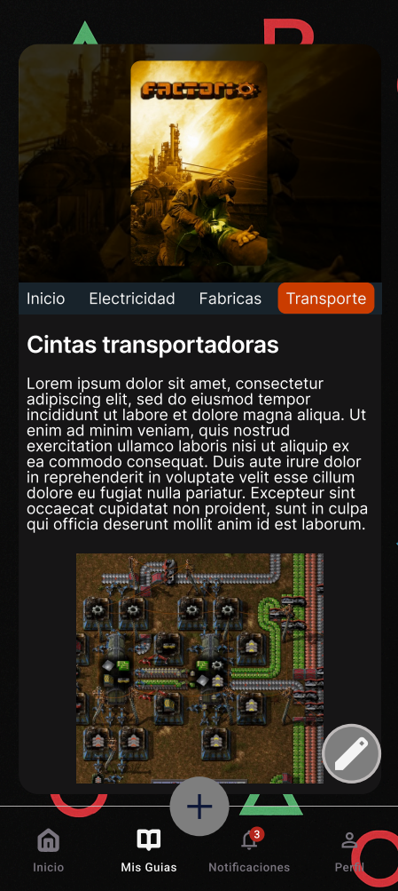
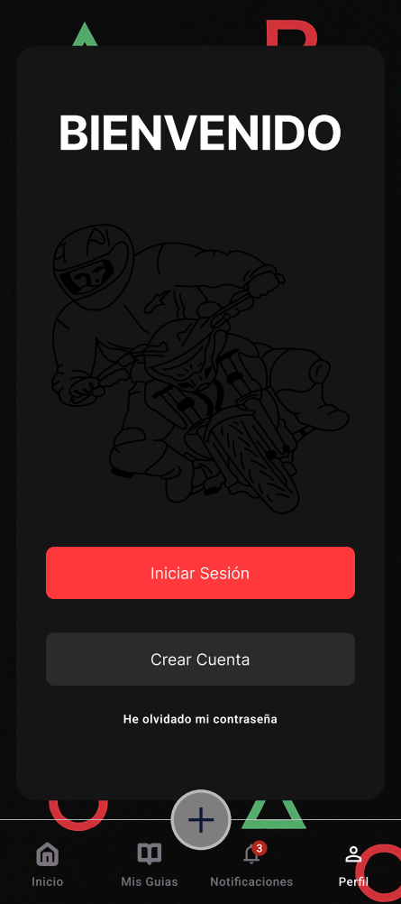

# Diseño de interfaz de usuario

La aplicación tendrá las siguientes pantallas

1. Pantalla 1: Inicio de la aplicación.

2. Pantalla 2: Como se ve la búsqueda de una guía.

4. Pantalla 4: Como se ve el apartado de las guías publicadas por el usuario.
   

   
5. Pantalla 5: Como se ven las guías desde la perspectiva del creador.
   

   
6. Pantalla 6: Como se ven las notificaciones.
   

   
7. Pantalla 7: Como se ve el apartado de cuenta sin haber iniciado sesión.
   

   
8. Pantalla 8: Como se ve el inicio de sesión.
   

    
9. Pantalla 9: Como se ve la creación de una cuenta.
   

    
10. Pantalla 10: Primera parte del momento de crear una guía.
   

# Referencias

- [Material Design: Foundations](https://m3.material.io/foundations)
- [Material Design: Style](https://m3.material.io/styles)
